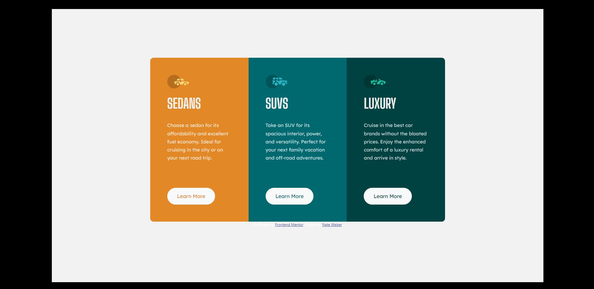

# Frontend Mentor - 3-column preview card component solution

This is a solution to the [3-column preview card component challenge on Frontend Mentor](https://www.frontendmentor.io/challenges/3column-preview-card-component-pH92eAR2-). Frontend Mentor challenges help you improve your coding skills by building realistic projects.

## Table of contents

- [Overview](#overview)
  - [Screenshot](#screenshot)
  - [Links](#links)
- [My process](#my-process)
  - [Built with](#built-with)
  - [What I learned](#what-i-learned)
  - [Continued development](#continued-development)
- [Author](#author)

## Overview

### Screenshot

### Links

- Solution URL: [GitHub](https://wwweber-3column.netlify.app/)
- Live Site URL: [Live Site](https://wwweber-nft.netlify.app/)

## My process

### Built with

- React (!)
- CSS custom properties
- Flexbox
- Mobile-first workflow
- Bootstrap
- SCSS
- BEM Model

### What I learned

I learned more about React and its limits.
I attempted to place information into an array and for the components to pull information from the array to create each column.
Eventually ran into an issue when trying to put an image URL into the array and have the url generate the image. Had to create a workaround for this.

### Continued development

React is still a struggle to work with, but I am becoming more accostomed to what the work flow is like.
Attempted to break down the project into small pieces to focus on the consepts more.

## Author

- Website - [Nate Weber](http://nateweber.name/)
- Frontend Mentor - [@WorldWideWeb-er](https://www.frontendmentor.io/profile/WorldWideWeb-er)
