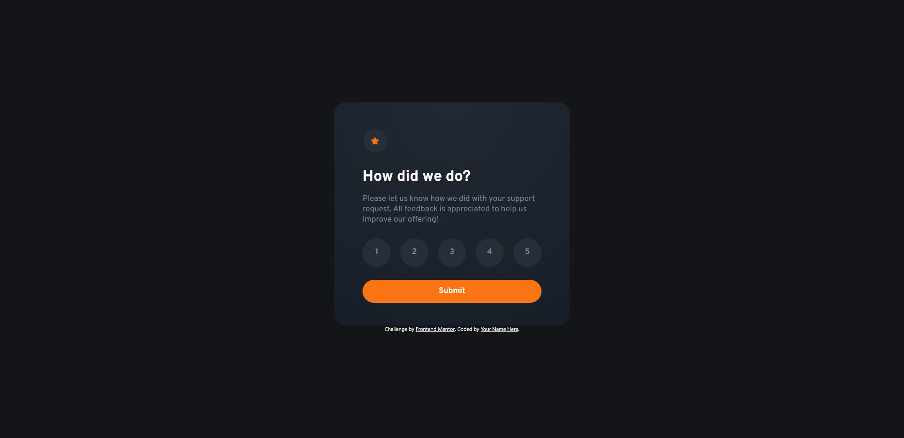

# Frontend Mentor - Interactive rating component solution

This is a solution to the [Interactive rating component challenge on Frontend Mentor](https://www.frontendmentor.io/challenges/interactive-rating-component-koxpeBUmI). Frontend Mentor challenges help you improve your coding skills by building realistic projects.

## Table of contents

- [Overview](#overview)
  - [The challenge](#the-challenge)
  - [Screenshot](#screenshot)
  - [Links](#links)
- [My process](#my-process)
  - [Built with](#built-with)
  - [What I learned](#what-i-learned)
  - [Continued development](#continued-development)
  - [Useful resources](#useful-resources)
- [Author](#author)
- [Acknowledgments](#acknowledgments)

**Note: Delete this note and update the table of contents based on what sections you keep.**

## Overview

### The challenge

Users should be able to:

- View the optimal layout for the app depending on their device's screen size
- See hover states for all interactive elements on the page
- Select and submit a number rating
- See the "Thank you" card state after submitting a rating

### Screenshot

### Links

- Solution URL: [GitHub](https://github.com/WorldWideWeb-er/Frontend_Mentor/tree/main/1.%20Newbie/interactive-rating-component-main)
- Live Site URL: [Uploaded](https://wwweber-rating.netlify.app/)

## My process

### Built with

- CSS custom properties
- Flexbox
- Mobile-first workflow
- Scss
- Javascript

### What I learned

I attempted to work with a more "mobile first" approach, having coded the site first through a mobile view, then adapt the site once it reached a certain breakmark.

### Continued development

Continued use of Flexbox and Bootstrap has been very beneficial and creating sites have become noticibly quicker

## Author

- Website - [Nate Weber](http://nateweber.name/)
- Frontend Mentor - [@WorldWideWeb-er](https://www.frontendmentor.io/profile/WorldWideWeb-er)
