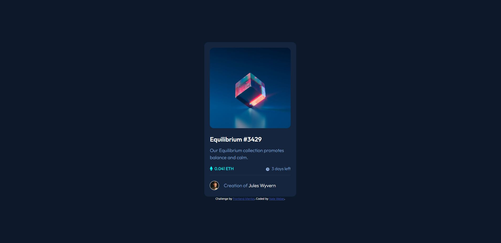

# Frontend Mentor - QR code component solution

This is a solution to the [QR code component challenge on Frontend Mentor](https://www.frontendmentor.io/challenges/qr-code-component-iux_sIO_H). Frontend Mentor challenges help you improve your coding skills by building realistic projects.

## Table of contents

- [Overview](#overview)
  - [Screenshot](#screenshot)
  - [Links](#links)
- [My process](#my-process)
  - [Built with](#built-with)
  - [What I learned](#what-i-learned)
  - [Continued development](#continued-development)
- [Author](#author)

## Overview

### Screenshot

### Links

- Solution URL: [GitHub](https://github.com/WorldWideWeb-er/Frontend_Mentor/tree/main/1.%20Newbie/nft-preview-card-component-main)
- Live Site URL: [Live Site](https://wwweber-nft.netlify.app/)

## My process

### Built with

- CSS custom properties
- Flexbox
- Mobile-first workflow
- Bootstrap
- SCSS
- BEM Model

### What I learned

I learned (more like attempted to) more about how to overlap objects.
Attempted to have the 'hover' image and color be on top of the NFT image became an issue and stumped me for awhile.

### Continued development

Continued use of Flexbox and Bootstrap will be used in every project due to my familiarity with these concepts.

## Author

- Website - [Nate Weber](http://nateweber.name/)
- Frontend Mentor - [@WorldWideWeb-er](https://www.frontendmentor.io/profile/WorldWideWeb-er)
