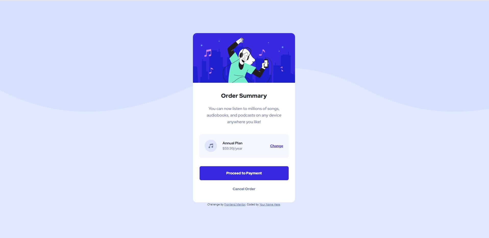

# Frontend Mentor - QR code component solution

This is a solution to the [QR code component challenge on Frontend Mentor](https://www.frontendmentor.io/challenges/qr-code-component-iux_sIO_H). Frontend Mentor challenges help you improve your coding skills by building realistic projects.

## Table of contents

- [Overview](#overview)
  - [Screenshot](#screenshot)
  - [Links](#links)
- [My process](#my-process)
  - [Built with](#built-with)
  - [What I learned](#what-i-learned)
  - [Continued development](#continued-development)
- [Author](#author)

## Overview

### Screenshot

### Links

- Solution URL: [Live Site](https://github.com/WorldWideWeb-er/Frontend_Mentor/tree/main/1.%20Newbie/order-summary-component-main)
- Live Site URL: [Live Site](https://wwweber-order.netlify.app/)

## My process

### Built with

- CSS custom properties
- Flexbox
- Mobile-first workflow
- Bootstrap
- SCSS
- BEM Model

### What I learned

I further improved on haveing images (svgs) as backround images.
Further improvement on all 'background-image-' properties and usability

### Continued development

Flexbox and Bootstrap now have become second hand when creating websites.
Further use of padding and margin to tweek layouts will become key to master all layouts.

## Author

- Website - [Nate Weber](http://nateweber.name/)
- Frontend Mentor - [@WorldWideWeb-er](https://www.frontendmentor.io/profile/WorldWideWeb-er)
