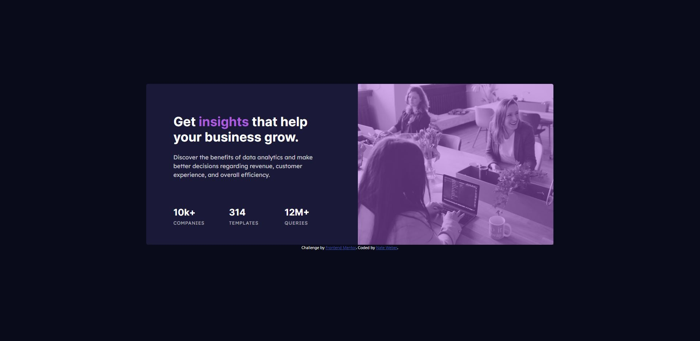

# Frontend Mentor - Stats preview card component solution

This is a solution to the [Stats preview card component challenge on Frontend Mentor](https://www.frontendmentor.io/challenges/stats-preview-card-component-8JqbgoU62). Frontend Mentor challenges help you improve your coding skills by building realistic projects.

## Table of contents

- [Overview](#overview)
  - [Screenshot](#screenshot)
  - [Links](#links)
- [My process](#my-process)
  - [Built with](#built-with)
  - [What I learned](#what-i-learned)
  - [Continued development](#continued-development)
- [Author](#author)

## Overview

### Screenshot

### Links

- Solution URL: [GitHub](https://github.com/WorldWideWeb-er/Frontend_Mentor/tree/main/1.%20Newbie/stats-preview-card-component-main)
- Live Site URL: [Live Site](https://wwweber-stats.netlify.app/)

## My process

### Built with

- React (!)
- CSS custom properties
- Flexbox
- Mobile-first workflow
- Bootstrap
- SCSS
- BEM Model

### What I learned

This was my first project using React. I had a few side project that I used to get a grasp of React, but this was putting that knowledge to the test.

Using React, I organized all my files and linked items together with index.js pages to clean up code.

### Continued development

Continued use of Flexbox and Bootstrap will be used in every project due to my familiarity with these concepts.
Padding and Margin have become more of a focus to change layouts.

## Author

- Website - [Nate Weber](http://nateweber.name/)
- Frontend Mentor - [@WorldWideWeb-er](https://www.frontendmentor.io/profile/WorldWideWeb-er)
